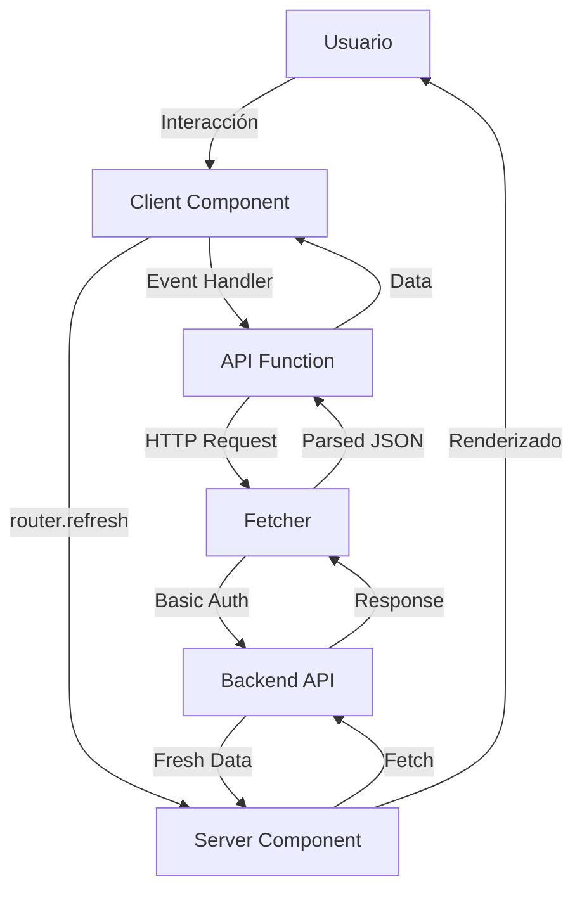

# Arquitectura del Frontend

El frontend de Frozen constituye la capa de presentación del sistema de gestión de producción. Está desarrollado en **Next.js** con **React** y **TypeScript**, implementando una arquitectura modular y escalable orientada a la separación de responsabilidades entre componentes, vistas, servicios y estilos.

El objetivo principal de esta aplicación es ofrecer una interfaz administrativa moderna para gestionar materiales, movimientos, órdenes de producción, lotes, embalajes, recetas, productos y fases, en correspondencia con las entidades del modelo de datos del backend.

El frontend de la aplicación está desarrollado utilizando Next.js 14 con el nuevo App Router, que representa una evolución significativa respecto a versiones anteriores al permitir un modelo híbrido de renderizado. Esta tecnología se combina con React 18, aprovechando sus últimas características como Server Components, Suspense mejorado y transiciones concurrentes.

La elección de Next.js responde a la necesidad del renderizado del lado del servidor (SSR), que mejora significativamente los tiempos de carga inicial, lo cual es esencial para operarios que necesitan acceder rápidamente a información de producción.

La arquitectura está diseñada siguiendo un patrón **feature-based**, en el cual cada módulo funcional (ej. "materiales", "movimientos") posee sus propios componentes, formularios y páginas.

## Stack Tecnológico

| Categoría            | Tecnología      | Versión | Propósito                   |
| -------------------- | --------------- | ------- | --------------------------- |
| **Framework**        | Next.js         | 15.1.4  | Framework React con SSR/SSG |
| **Librería UI**      | React           | 19.0.0  | Librería de componentes     |
| **Lenguaje**         | TypeScript      | 5.x     | Tipado estático             |
| **Estilos**          | Tailwind CSS    | 3.4.1   | Framework CSS utility-first |
| **Componentes UI**   | shadcn/ui       | -       | Componentes reutilizables   |
| **Iconos**           | Lucide React    | 0.468.0 | Sistema de iconos           |
| **Formularios**      | React Hook Form | -       | Gestión de formularios      |
| **Validación**       | Zod             | -       | Validación de schemas       |
| **Notificaciones**   | Sonner          | -       | Sistema de toasts           |
| **Testing**          | Playwright      | -       | Testing E2E                 |
| **State Management** | React Hooks     | -       | Estado local y compartido   |

## Estructura de Carpetas

```
frozen-frontend/
├── app/                                    # App Router de Next.js
│   ├── (dashboard)/                       # Grupo de rutas con layout compartido
│   │   ├── layout.tsx                     # Layout del dashboard
│   │   ├── loading.tsx                    # Loading UI global
│   │   ├── page.tsx                       # Dashboard principal
│   │   │
│   │   ├── materiales/                    # Módulo de materiales
│   │   │   ├── page.tsx                   # Lista de materiales (Server Component)
│   │   │   ├── loading.tsx                # Loading específico
│   │   │   └── _components/               # Componentes privados del módulo
│   │   │       ├── materials-client.tsx   # Lógica del cliente
│   │   │       ├── materials-table.tsx    # Tabla desktop
│   │   │       ├── materials-cards.tsx    # Cards mobile
│   │   │       ├── materials-filters.tsx  # Filtros de búsqueda
│   │   │       ├── material-form.tsx      # Formulario crear/editar
│   │   │       └── create-button.tsx      # Botón de creación
│   │   │
│   │   ├── productos/                     # Módulo de productos
│   │   │   ├── page.tsx                   # Lista de productos
│   │   │   ├── loading.tsx                # Loading UI
│   │   │   ├── [id]/                      # Ruta dinámica para detalle
│   │   │   │   ├── page.tsx               # Detalle del producto
│   │   │   │   └── loading.tsx            # Loading del detalle
│   │   │   └── _components/               # Componentes del módulo
│   │   │       ├── products-client.tsx
│   │   │       ├── products-table.tsx
│   │   │       ├── products-cards.tsx
│   │   │       ├── products-filters.tsx
│   │   │       ├── product-form.tsx
│   │   │       ├── product-detail-client.tsx
│   │   │       ├── product-info-card.tsx
│   │   │       ├── phases-list.tsx
│   │   │       ├── phase-form.tsx
│   │   │       ├── recipe-form.tsx
│   │   │       └── recipe-edit-form.tsx
│   │   │
│   │   ├── movimientos/                   # Módulo de movimientos
│   │   ├── ordenes/                       # Módulo de órdenes de producción
│   │   ├── packagings/                    # Módulo de empaques
│   │   ├── seguimiento/                   # Módulo de seguimiento de lotes
│   │   ├── reportes/                      # Módulo de reportes
│   │   └── configuracion/                 # Configuración del sistema
│   │
│   ├── layout.tsx                         # Layout raíz de la aplicación
│   └── globals.css                        # Estilos globales
│
├── components/                            # Componentes compartidos
│   ├── layout/                           # Componentes de layout
│   │   ├── header.tsx                    # Header con navegación
│   │   ├── sidebar.tsx                   # Sidebar desktop
│   │   ├── bottom-bar.tsx                # Navegación móvil
│   │   ├── navigation.tsx                # Links de navegación
│   │   └── navigation-loader.tsx         # Indicador de carga
│   │
│   ├── ui/                               # Componentes UI base (shadcn)
│   │   ├── button.tsx
│   │   ├── card.tsx
│   │   ├── dialog.tsx
│   │   ├── table.tsx
│   │   ├── data-table.tsx                # Tabla de datos genérica
│   │   ├── data-cards.tsx                # Cards genéricas
│   │   ├── pagination-client.tsx         # Paginación
│   │   ├── empty-state.tsx               # Estado vacío
│   │   ├── error-state.tsx               # Estado de error
│   │   ├── loading-spinner.tsx           # Spinner de carga
│   │   └── ...                           # Otros componentes UI
│   │
│   ├── dashboard/                        # Componentes del dashboard
│   │   ├── stat-card.tsx                 # Tarjetas de estadísticas
│   │   ├── inventory-chart.tsx           # Gráfico de inventario
│   │   └── stock-alerts.tsx              # Alertas de stock
│   │
│   └── production/                       # Componentes de producción
│       ├── batch-card.tsx
│       ├── batch-stats.tsx
│       └── order-card.tsx
│
├── lib/                                  # Utilidades y lógica de negocio
│   ├── fetcher.ts                       # Cliente HTTP para API
│   ├── api-error.ts                     # Manejo de errores de API
│   ├── error-handler.ts                 # Handler global de errores
│   ├── type-validation.ts               # Validadores de tipos
│   ├── utils.ts                         # Utilidades generales
│   │
│   ├── materials-api.ts                 # API de materiales
│   ├── products-api.ts                  # API de productos
│   ├── product-phases-api.ts            # API de fases
│   ├── recipes-api.ts                   # API de recetas
│   ├── movements-api.ts                 # API de movimientos
│   ├── production-orders-api.ts         # API de órdenes
│   ├── batches-api.ts                   # API de lotes
│   └── packagings-api.ts                # API de empaques
│
├── types/                               # Definiciones de tipos TypeScript
│   └── index.ts                         # Tipos compartidos
│
├── hooks/                               # Custom React Hooks
│   ├── use-mobile.ts                    # Hook para detección móvil
│   └── use-toast.ts                     # Hook para notificaciones
│
├── docs/                                # Documentación técnica
│   ├── FRONTEND_ARCHITECTURE.md         # Arquitectura del frontend
│   ├── COMPONENT_PATTERNS.md            # Patrones de componentes
│   ├── DESIGN_SYSTEM.md                 # Sistema de diseño
│   ├── SSR_OPTIMIZATION.md              # Optimizaciones SSR
│   ├── NAVIGATION_LOADING.md            # Sistema de navegación
│   ├── BACKEND_INTEGRATION_GUIDE.md     # Integración con backend
│   └── PROJECT_CONTEXT.md               # Contexto del proyecto
│
├── tests/                               # Tests E2E con Playwright
│   ├── home/                            # Tests del dashboard
│   ├── materials/                       # Tests de materiales
│   ├── products/                        # Tests de productos
│   ├── movements/                       # Tests de movimientos
│   └── packagings/                      # Tests de empaques
│
├── public/                              # Archivos estáticos
│   ├── Frozen-icon.png                  # Logo de la aplicación
│   └── Frozen-loading.png               # Logo para loading
│
├── next.config.mjs                      # Configuración de Next.js
├── tailwind.config.ts                   # Configuración de Tailwind
├── tsconfig.json                        # Configuración de TypeScript
└── package.json                         # Dependencias del proyecto

```

## Patrones de Arquitectura

### Server Components vs Client Components

Next.js 14 introduce un modelo híbrido donde los componentes son **Server Components** por defecto, lo que permite:

- **Renderizado en el servidor**: Genera HTML en el servidor para mejorar SEO y tiempo de carga inicial
- **Menor bundle JavaScript**: Solo se envía JavaScript necesario al cliente
- **Acceso directo a datos**: Pueden hacer fetch directamente en el servidor sin exponer credenciales

**Server Components (por defecto):**

```tsx
// app/(dashboard)/productos/page.tsx
export default async function ProductosPage({
  searchParams,
}: ProductosPageProps) {
  const params = await searchParams;
  const page = parseInt(params.page || "0");

  // Fetch directo en el servidor
  const productsData = await getProducts({ page, size: 10 });

  return (
    <>
      <Header title="Productos" />
      <ProductsClient productos={productsData.products} />
    </>
  );
}
```

**Client Components (cuando se necesita interactividad):**

```tsx
// _components/products-client.tsx
"use client";

export function ProductsClient({ productos }: ProductsClientProps) {
  const [selectedProduct, setSelectedProduct] =
    useState<ProductResponse | null>(null);
  const router = useRouter();

  const handleEdit = async (id: string, data: ProductUpdateRequest) => {
    await updateProduct(id, data);
    router.refresh(); // Refresca datos del servidor
  };

  return <ProductsTable productos={productos} onEdit={handleEdit} />;
}
```

**Cuándo usar Client Components:**

- Hooks de React (useState, useEffect, useContext)
- Event handlers (onClick, onChange)
- APIs del navegador (localStorage, window)
- Hooks de Next.js (useRouter, usePathname)

### Sistema de Navegación

El sistema implementa una navegación optimizada con feedback visual:

**Componentes de navegación:**

1. **Sidebar (Desktop)**: Navegación lateral con íconos y etiquetas
2. **BottomBar (Mobile)**: Barra inferior con íconos para pantallas pequeñas
3. **NavigationLoader**: Barra de progreso que indica cambios de ruta

```tsx
// components/layout/sidebar.tsx
"use client";

export function Sidebar() {
  const pathname = usePathname();
  const isActive = (path: string) => pathname === path;

  return (
    <aside className="hidden md:flex flex-col w-64 bg-primary-900">
      <Navigation isActive={isActive} />
    </aside>
  );
}

// components/layout/bottom-bar.tsx
("use client");

export function BottomBar() {
  return (
    <nav className="md:hidden fixed bottom-0 left-0 right-0 bg-white border-t">
      {/* Navegación móvil con íconos */}
    </nav>
  );
}
```

### Loading UI y Streaming

Next.js permite definir estados de carga específicos para cada ruta mediante archivos `loading.tsx`:

```tsx
// app/(dashboard)/productos/loading.tsx
export default function ProductosLoading() {
  return (
    <>
      <Header title="Productos" subtitle="Cargando productos..." />
      <PageLoader />
    </>
  );
}
```

**Beneficios:**

- Feedback visual inmediato al cambiar de ruta
- Streaming SSR: el servidor envía HTML progresivamente
- Mejora la percepción de velocidad

## Sistema de Tipos TypeScript

El sistema define tipos estrictos para todas las entidades del dominio:

```tsx
// types/index.ts

// Enums
export type MaterialType = "MALTA" | "LUPULO" | "LEVADURA" | "ENVASE" | "OTROS";
export type MovementType = "INGRESO" | "EGRESO" | "RESERVA" | "DEVUELTO";
export type BatchStatus =
  | "PENDIENTE"
  | "EN_PRODUCCION"
  | "COMPLETADO"
  | "CANCELADO";
export type ProductionOrderStatus =
  | "PENDIENTE"
  | "APROBADA"
  | "RECHAZADA"
  | "CANCELADA";

// DTOs de Response
export interface MaterialResponse {
  id: string;
  name: string;
  type: MaterialType;
  supplier: string | null;
  stock: number;
  reservedStock: number;
  unitMeasurement: UnitMeasurement;
  threshold: number;
  isActive: boolean;
  creationDate: string;
}

export interface ProductResponse {
  id: string;
  name: string;
  isAlcoholic: boolean;
  isActive: boolean;
  isReady: boolean;
  standardQuantity: number;
  unitMeasurement: UnitMeasurement;
  creationDate: string;
}

// DTOs de Request
export interface MaterialCreateRequest {
  name: string;
  type: MaterialType;
  supplier?: string;
  stock: number;
  unitMeasurement: UnitMeasurement;
  threshold: number;
}

export interface ProductUpdateRequest {
  name?: string;
  isAlcoholic?: boolean;
  standardQuantity?: number;
  unitMeasurement?: UnitMeasurement;
}

// Respuestas paginadas
export interface PageResponse<T> {
  content: T[];
  currentPage: number;
  totalPages: number;
  totalItems: number;
  size: number;
  isFirst: boolean;
  isLast: boolean;
}
```

## Comunicación con el Backend

### Fetcher: Cliente HTTP Centralizado

El sistema utiliza un cliente HTTP centralizado que maneja autenticación, errores y serialización:

```tsx
// lib/fetcher.ts

const BACKEND_URL =
  process.env.NEXT_PUBLIC_BACKEND_URL || "<http://localhost:8080>";

// Credenciales de Spring Security
const DEFAULT_USERNAME = "user";
const DEFAULT_PASSWORD = "1234";

export async function fetcher<T>(
  endpoint: string,
  options: FetcherOptions = {}
): Promise<T> {
  const { params, auth, ...fetchOptions } = options;

  // Construir URL con parámetros
  let url = `${BACKEND_URL}${endpoint}`;
  if (params) {
    const searchParams = new URLSearchParams(params);
    url += `?${searchParams.toString()}`;
  }

  // Autenticación básica
  const username = auth?.username || DEFAULT_USERNAME;
  const password = auth?.password || DEFAULT_PASSWORD;
  const basicAuth = btoa(`${username}:${password}`);

  const response = await fetch(url, {
    ...fetchOptions,
    headers: {
      Authorization: `Basic ${basicAuth}`,
      "Content-Type": "application/json",
      ...fetchOptions.headers,
    },
  });

  // Manejo de errores
  if (!response.ok) {
    const errorData = await response.json();
    throw new ApiError(
      errorData.message,
      response.status,
      response.statusText,
      errorData
    );
  }

  if (response.status === 204) return null as T;

  return await response.json();
}

// API helpers
export const api = {
  get: <T,>(endpoint: string, params?: Record<string, string>) =>
    fetcher<T>(endpoint, { method: "GET", params }),

  post: <T,>(endpoint: string, data?: unknown) =>
    fetcher<T>(endpoint, { method: "POST", body: JSON.stringify(data) }),

  patch: <T,>(endpoint: string, data?: unknown) =>
    fetcher<T>(endpoint, { method: "PATCH", body: JSON.stringify(data) }),

  delete: <T,>(endpoint: string) => fetcher<T>(endpoint, { method: "DELETE" }),
};
```

### APIs por Módulo

Cada módulo tiene su propio archivo de API con funciones específicas:

```tsx
// lib/products-api.ts

export async function getProducts(
  filters: {
    page?: number;
    size?: number;
    name?: string;
    estado?: string;
    alcoholic?: string;
    ready?: string;
  } = {}
) {
  const apiFilters = mapFiltersToAPI(filters);
  const urlParams: Record<string, string> = {};

  if (apiFilters.page !== undefined)
    urlParams.page = apiFilters.page.toString();
  if (apiFilters.size !== undefined)
    urlParams.size = apiFilters.size.toString();
  if (apiFilters.name) urlParams.name = apiFilters.name;
  if (apiFilters.isActive !== undefined)
    urlParams.isActive = apiFilters.isActive.toString();

  const response = await api.get<ProductPageResponse>(
    "/api/products",
    urlParams
  );

  return {
    products: response.content,
    pagination: {
      currentPage: response.currentPage,
      totalPages: response.totalPages,
      totalElements: response.totalItems,
      size: response.size,
      first: response.isFirst,
      last: response.isLast,
    },
  };
}

export async function getProductById(id: string) {
  return await api.get<ProductResponse>(`/api/products/${id}`);
}

export async function createProduct(data: ProductCreateRequest) {
  return await api.post<ProductResponse>("/api/products", data);
}

export async function updateProduct(id: string, data: ProductUpdateRequest) {
  return await api.patch<ProductResponse>(`/api/products/${id}`, data);
}

export async function toggleProductActive(id: string) {
  return await api.patch<ProductResponse>(`/api/products/${id}/toggle-active`);
}
```

## Componentes Reutilizables

### DataTable: Tabla Genérica

Componente genérico para mostrar datos tabulares con acciones:

```tsx
// components/ui/data-table.tsx

interface DataTableProps<T> {
  data: T[];
  columns: ColumnDef<T>[];
  actions?: TableActions<T>;
  emptyMessage?: string;
}

export function DataTable<T extends Record<string, any>>({
  data,
  columns,
  actions,
  emptyMessage,
}: DataTableProps<T>) {
  return (
    <div className="overflow-x-auto">
      <table className="w-full">
        <thead>
          <tr>
            {columns.map((col) => (
              <th key={col.key}>{col.label}</th>
            ))}
            {actions && <th>Acciones</th>}
          </tr>
        </thead>
        <tbody>
          {data.length === 0 ? (
            <tr>
              <td colSpan={columns.length + 1}>
                {emptyMessage || "No hay datos"}
              </td>
            </tr>
          ) : (
            data.map((item, index) => (
              <tr key={index}>
                {columns.map((col) => (
                  <td key={col.key}>
                    {col.render
                      ? col.render(item[col.key], item)
                      : item[col.key]}
                  </td>
                ))}
                {actions && (
                  <td>
                    <ActionButtons item={item} actions={actions} />
                  </td>
                )}
              </tr>
            ))
          )}
        </tbody>
      </table>
    </div>
  );
}
```

### Patrón Tabla/Cards Responsive

Cada módulo implementa dos vistas: tabla para desktop y cards para móvil:

```tsx
// _components/products-client.tsx

export function ProductsClient({ productos }: ProductsClientProps) {
  return (
    <>
      {/* Desktop: Tabla */}
      <ProductsTable
        productos={productos}
        onEdit={handleEdit}
        className="hidden md:block"
      />

      {/* Mobile: Cards */}
      <ProductsCards
        productos={productos}
        onEdit={handleEdit}
        className="md:hidden"
      />
    </>
  );
}
```

## Diseño Responsive y Mobile-First

El sistema sigue un enfoque **mobile-first**, optimizado para pantallas desde 320px:

### Breakpoints

```css
/* Tailwind CSS breakpoints */
xs: < 640px     /* Móviles pequeños */
sm: 640px       /* Móviles grandes */
md: 768px       /* Tablets */
lg: 1024px      /* Desktop pequeño */
xl: 1280px      /* Desktop grande */
2xl: 1536px     /* Desktop extra grande */

```

### Patrones Responsive

**1. Layout adaptativo:**

```tsx
<div className="flex flex-col md:flex-row gap-4">
  {/* Vertical en móvil, horizontal en desktop */}
</div>
```

**2. Tipografía responsive:**

```tsx
<h1 className="text-xl md:text-2xl font-bold">{/* Más pequeño en móvil */}</h1>
```

**3. Padding y spacing:**

```tsx
<div className="p-4 md:p-6 gap-3 md:gap-6">{/* Menos padding en móvil */}</div>
```

**4. Componentes condicionales:**

```tsx
{
  /* Solo desktop */
}
<Sidebar className="hidden md:flex" />;

{
  /* Solo móvil */
}
<BottomBar className="md:hidden" />;
```

**5. Botones responsive:**

```tsx
<Button className="w-full md:w-auto text-xs md:text-sm">
  <Icon className="w-4 h-4 mr-1.5 md:mr-2" />
  <span>Texto visible en todas las pantallas</span>
</Button>
```

## Manejo de Errores

### Sistema Centralizado de Errores

```tsx
// lib/error-handler.ts

export function handleError(error: unknown, options?: ErrorOptions) {
  if (ApiError.isApiError(error)) {
    // Error de la API
    toast.error(options?.title || "Error", {
      description: error.message,
      duration: 5000,
    });
  } else if (error instanceof Error) {
    // Error genérico
    toast.error(options?.title || "Error", {
      description: error.message,
    });
  } else {
    // Error desconocido
    toast.error("Error", {
      description: "Ha ocurrido un error inesperado",
    });
  }
}

export function showSuccess(message: string) {
  toast.success("Éxito", {
    description: message,
    duration: 3000,
  });
}
```

### Uso en componentes:

```tsx
try {
  await updateProduct(id, data);
  showSuccess("Producto actualizado exitosamente");
  router.refresh();
} catch (error) {
  handleError(error, {
    title: "Error al actualizar producto",
  });
}
```

## Optimizaciones de Rendimiento

### 1. Llamadas Paralelas al Backend

**Problema:** Llamadas secuenciales lentas

```tsx
// ❌ LENTO: Llamadas secuenciales
for (const phase of phases) {
  const recipes = await getRecipes(phase.id); // Espera una por una
}
```

**Solución:** Usar `Promise.all()`

```tsx
// ✅ RÁPIDO: Llamadas en paralelo
const recipePromises = phases.map((phase) => getRecipes(phase.id));
const results = await Promise.all(recipePromises);
```

**Impacto:** 4-5x más rápido con 5 fases (de ~3-5s a ~500ms-1s)

### 2. Loading UI Específicos

Cada ruta tiene su propio `loading.tsx` para feedback inmediato:

```tsx
// app/(dashboard)/productos/loading.tsx
export default function ProductosLoading() {
  return <PageLoader message="Cargando productos..." />;
}
```

### 3. Prefetching Automático

Next.js precarga automáticamente rutas visibles:

```tsx
<Link href="/productos/123">
  {" "}
  {/* Se precarga automáticamente */}
  Ver Producto
</Link>
```

### 4. Code Splitting

Cada ruta carga solo el JavaScript necesario automáticamente.

## Testing End-to-End

El sistema incluye tests E2E con Playwright:

```jsx
// tests/products/productsTest.test.js

const { test, expect } = require("@playwright/test");

test("Crear producto exitosamente", async ({ page }) => {
  await page.goto("<http://localhost:3000/productos>");

  // Click en botón crear
  await page.click('[data-testid="create-product-btn"]');

  // Llenar formulario
  await page.fill('input[name="name"]', "Cerveza IPA");
  await page.selectOption('select[name="unitMeasurement"]', "LT");
  await page.fill('input[name="standardQuantity"]', "100");

  // Enviar formulario
  await page.click('button[type="submit"]');

  // Verificar éxito
  await expect(page.locator("text=Producto creado exitosamente")).toBeVisible();
});
```

### Módulos con Tests

- Home / Dashboard
- Materiales (CRUD completo)
- Productos (crear, editar, buscar)
- Movimientos (crear, filtrar, detalles)
- Packagings (crear)

## Sistema de Diseño

### Paleta de Colores

```css
/* colors del tema principal (verde cervecero) */
--primary-50: #F0FDF4
--primary-100: #DCFCE7
--primary-600: #16A34A  /* Color principal */
--primary-700: #15803D
--primary-900: #14532D

/* Colores de estado */
--success: #10B981   /* Verde */
--warning: #F59E0B   /* Amarillo */
--error: #EF4444     /* Rojo */
--info: #3B82F6      /* Azul */

```

### Componentes Base

Todos los componentes UI están basados en **shadcn/ui**, permitiendo:

- **Personalización completa**: Los componentes se copian al proyecto
- **Consistencia**: Mismo diseño en toda la aplicación
- **Accesibilidad**: Cumple con ARIA y WCAG 2.1
- **TypeScript**: Tipado completo

## Flujo de Datos



## Despliegue y Configuración

### Variables de Entorno

```bash
# .env.local
NEXT_PUBLIC_BACKEND_URL=https://frozen-backend-production.up.railway.app

```

### Configuración de Next.js

```jsx
// next.config.mjs
const nextConfig = {
  reactStrictMode: true,
  images: {
    domains: ["frozen-backend-production.up.railway.app"],
  },
};
```

## Mejores Prácticas Implementadas

1. **Server Components por defecto**: Reduce JavaScript del cliente
2. **Client Components solo cuando necesario**: Para interactividad
3. **Loading UI en cada ruta**: Feedback visual inmediato
4. **Error boundaries**: Manejo graceful de errores
5. **TypeScript estricto**: Prevención de errores en tiempo de desarrollo
6. **Mobile-first**: Optimización para dispositivos móviles
7. **Llamadas paralelas**: Optimización de rendimiento
8. **Componentes reutilizables**: DRY (Don't Repeat Yourself)
9. **Testing E2E**: Verificación de flujos completos
10. **Documentación exhaustiva**: Guías técnicas en `/docs`
